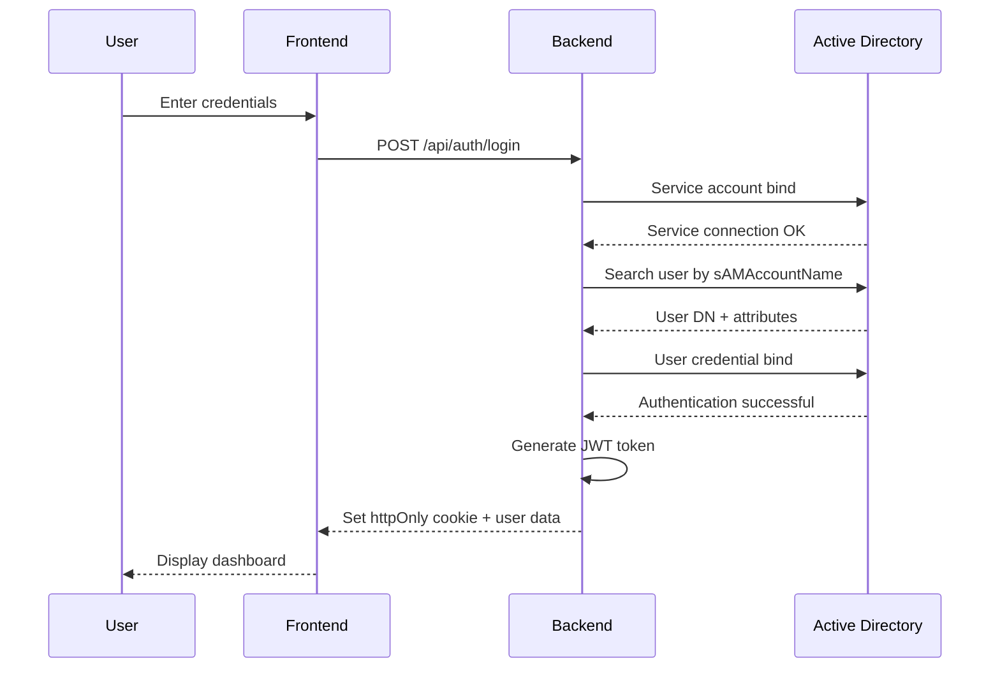

## Overview

RDSWeb Custom uses Active Directory (AD) integration with JWT-based sessions to provide secure authentication for RemoteApp access. The system supports both production AD environments and simulation mode for development.

## Authentication Flow



## Login Process

The login flow involves several steps to securely authenticate users against Active Directory:

### 1. Username Normalization

RDSWeb Custom accepts multiple username formats:

- `username` - Simple username (uses default domain)
- `DOMAIN\username` - Windows domain format
- `username@domain.local` - UPN format

```javascript
// Example username parsing logic
function parseUsername(username) {
  if (username.includes('\\')) {
    const [domain, cleanUser] = username.split('\\');
    return { domain: domain.toUpperCase(), cleanUser };
  }
  if (username.includes('@')) {
    const [cleanUser, domainSuffix] = username.split('@');
    return { domain: domainSuffix.split('.')[0].toUpperCase(), cleanUser };
  }
  return { domain: 'LAB-MH', cleanUser: username };
}
```

### 2. Active Directory Lookup

The system uses a **service account** with read-only permissions to query AD. This is an enterprise security best practice:

```javascript
const adOptions = {
  ldapOpts: {
    url: 'ldap://dc01.lab-mh.local',
    tlsOptions: { rejectUnauthorized: false }
  },
  // Service account for initial search
  adminDn: 'svc-rdweb@lab-mh.local',
  adminPassword: process.env.AD_SERVICE_PASS,
  // User search parameters
  userSearchBase: 'DC=lab-mh,DC=local',
  usernameAttribute: 'sAMAccountName',
  username: 'juan.perez',
  userPassword: userEnteredPassword,
  // Attributes to retrieve
  attributes: ['displayName', 'mail', 'memberOf', 'sAMAccountName']
};
```

**Why use a service account?**

- Anonymous LDAP queries are disabled in most AD environments
- Service account has **read-only** permissions (cannot modify AD)
- User credentials are validated through a separate bind operation
- Allows retrieval of user attributes (groups, email, display name)

### 3. Credential Validation

After finding the user's DN (Distinguished Name), the system performs a second LDAP bind using the user's actual credentials:

```javascript
// The ldap-authentication library performs:
// 1. Bind with service account → find user DN
// 2. Bind with user credentials → validate password
const user = await authenticate(adOptions);
```

This two-step process ensures:
- Service account never has access to user passwords
- User credentials are validated by AD itself
- All AD password policies are enforced

### 4. Group Membership Extraction

The system extracts AD group memberships from the `memberOf` attribute:

```javascript
function extractGroups(memberOf) {
  if (!memberOf) return [];
  const arr = Array.isArray(memberOf) ? memberOf : [memberOf];
  // memberOf format: "CN=RemoteApp Users,OU=Groups,DC=lab-mh,DC=local"
  return arr.map((dn) => dn.split(',')[0].replace(/^CN=/i, ''));
}

// Example output: ['RemoteApp Users', 'Domain Admins']
```

These groups can be used for authorization and app filtering.

## JWT Session Management

After successful AD authentication, the system creates a JWT token containing user information:

### Token Structure

```javascript
const payload = {
  username: 'juan.perez',
  displayName: 'Juan Pérez',
  email: 'juan.perez@lab-mh.local',
  domain: 'LAB-MH',
  groups: ['RemoteApp Users'],
  privateMode: true  // Session mode selection
};

const token = jwt.sign(payload, config.jwt.secret, { 
  expiresIn: '8h'  // Maximum token lifetime
});
```

### Secure Cookie Storage

Tokens are stored in httpOnly cookies for security:

```javascript
res.cookie('rdweb_token', token, {
  httpOnly: true,           // JavaScript cannot access (XSS protection)
  secure: true,             // HTTPS only in production
  sameSite: 'lax',          // CSRF protection
  maxAge: 20 * 60 * 1000,   // 20 minutes (public mode)
  path: '/'
});
```

**Security benefits:**
- `httpOnly` prevents XSS attacks from stealing tokens
- `secure` ensures tokens only travel over HTTPS
- `sameSite` protects against CSRF attacks
- Short expiration times reduce token theft impact

### Token Verification

Every authenticated request verifies the JWT:

```javascript
function authenticate(req, res, next) {
  const token = req.cookies?.rdweb_token;
  if (!token) {
    return res.status(401).json({ 
      error: 'No autenticado', 
      code: 'NO_TOKEN' 
    });
  }
  
  try {
    const payload = jwt.verify(token, config.jwt.secret);
    req.user = payload;  // Attach user to request
    next();
  } catch (err) {
    if (err.name === 'TokenExpiredError') {
      return res.status(401).json({ 
        error: 'Sesión expirada', 
        code: 'TOKEN_EXPIRED' 
      });
    }
    return res.status(401).json({ 
      error: 'Token inválido', 
      code: 'INVALID_TOKEN' 
    });
  }
}
```

## API Endpoints

### Login

```http
POST /api/auth/login
Content-Type: application/json

{
  "username": "juan.perez",
  "password": "Usuario1234!",
  "privateMode": true
}
```

**Response (Success):**

```json
{
  "ok": true,
  "user": {
    "username": "juan.perez",
    "displayName": "Juan Pérez",
    "email": "juan.perez@lab-mh.local",
    "domain": "LAB-MH",
    "initials": "JP"
  }
}
```

**Response (Error):**

```json
{
  "error": "Credenciales incorrectas. Verifica tu usuario y contraseña.",
  "code": "INVALID_CREDENTIALS"
}
```

### Get Current User

```http
GET /api/auth/me
Cookie: rdweb_token=eyJhbGc...
```

**Response:**

```json
{
  "username": "juan.perez",
  "displayName": "Juan Pérez",
  "email": "juan.perez@lab-mh.local",
  "domain": "LAB-MH",
  "initials": "JP",
  "privateMode": true
}
```

### Logout

```http
POST /api/auth/logout
```

Clears the authentication cookie and invalidates the session.

## Error Handling

The authentication system returns specific error codes for different failure scenarios:

| Error Code | Description | HTTP Status |
|------------|-------------|-------------|
| `MISSING_FIELDS` | Username or password not provided | 400 |
| `INVALID_CREDENTIALS` | Wrong username or password | 401 |
| `USER_NOT_FOUND` | User doesn't exist in AD | 401 |
| `AD_UNREACHABLE` | Cannot connect to Active Directory | 500 |
| `NO_TOKEN` | No authentication token provided | 401 |
| `TOKEN_EXPIRED` | Session has expired | 401 |
| `INVALID_TOKEN` | Token is corrupted or invalid | 401 |

## Simulation Mode

For development without Active Directory access, enable simulation mode:

```bash
# .env
SIMULATION_MODE=true
SIMULATION_USER=administrador
SIMULATION_PASS=Admin1234!
```

Simulation mode uses hardcoded test users:

```javascript
const SIMULATED_USERS = [
  {
    username: 'administrador',
    password: 'Admin1234!',
    displayName: 'Administrador',
    email: 'admin@lab-mh.local',
    domain: 'LAB-MH',
    groups: ['RemoteApp Users', 'Domain Admins']
  },
  {
    username: 'juan.perez',
    password: 'Usuario1234!',
    displayName: 'Juan Pérez',
    email: 'juan.perez@lab-mh.local',
    domain: 'LAB-MH',
    groups: ['RemoteApp Users']
  }
];
```

## Security Best Practices

1. **Service Account Security**
   - Use a dedicated service account with read-only AD permissions
   - Store credentials in environment variables, never in code
   - Rotate service account passwords regularly

2. **JWT Secret Management**
   - Generate a strong random secret for production
   - Never commit secrets to version control
   - Use different secrets for dev/staging/prod

3. **Session Timeouts**
   - Public mode: 20 minutes (shorter timeout for shared computers)
   - Private mode: 240 minutes (longer for personal devices)
   - See [Session Modes](/features/session-modes) for details

4. **HTTPS in Production**
   - Always use HTTPS to protect credentials in transit
   - Enable `secure: true` cookie flag in production
   - Consider implementing certificate pinning

## Configuration Reference

Authentication is configured through environment variables:

```bash
# JWT Configuration
JWT_SECRET=your-super-secret-key-change-this-in-production
JWT_EXPIRES_IN=8h

# Active Directory
LDAP_URL=ldap://dc01.lab-mh.local
LDAP_BASE_DN=DC=lab-mh,DC=local
AD_DOMAIN=LAB-MH
AD_SERVICE_USER=svc-rdweb@lab-mh.local
AD_SERVICE_PASS=YourServiceAccountPassword

# Development
SIMULATION_MODE=false
NODE_ENV=production
```

See the [Configuration Guide](/deployment/configuration) for complete details.

## Next Steps

- Learn about [Session Modes](/features/session-modes) and timeout behavior
- Explore the [RemoteApp Catalog](/features/remoteapp-catalog) system
- Understand [RDP File Generation](/features/rdp-generation)
