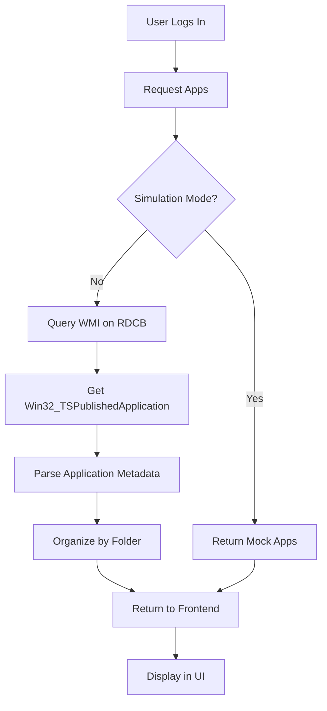

## Overview

The RemoteApp Catalog system discovers published applications from the RD Connection Broker (RDCB) and presents them to authenticated users. Applications are automatically organized into folders and filtered based on user permissions.

## How It Works



## Discovery Process

### Production Mode: WMI Query

In production, the system queries the RD Connection Broker using PowerShell and WMI:

```javascript
// backend/src/services/rdcbService.js
const psScript = `
  $apps = Get-WmiObject -Namespace "root\\cimv2\\TerminalServices" \\
    -Class Win32_TSPublishedApplication \\
    -ComputerName "${config.rdcb.server}" | 
    Select-Object -Property Name, Alias, VPath, IconPath, FolderName
  $apps | ConvertTo-Json -Compress
`;

const result = execSync(
  `powershell -NonInteractive -Command "${psScript}"`,
  { encoding: 'utf8', timeout: 10000 }
);
```

**WMI Class: Win32_TSPublishedApplication**

This class provides metadata about published RemoteApps:

| Property | Description | Example |
|----------|-------------|----------|
| `Name` | Display name | "Microsoft Word 2019" |
| `Alias` | Internal identifier | "MSWORD" |
| `VPath` | Virtual path in collection | "||MSWORD" |
| `IconPath` | Path to application icon | "%ProgramFiles%\\..." |
| `FolderName` | Organizational folder | "Microsoft Office" |

### Data Transformation

The raw WMI data is transformed into a normalized format:

```javascript
const apps = appsArray.map((a) => ({
  alias: a.Alias,              // "MSWORD"
  name: a.Name,                // "Microsoft Word 2019"
  rdpPath: `||${a.Alias}`,     // "||MSWORD"
  iconIndex: 0,
  remoteServer: config.rdcb.server,
  folderName: a.FolderName || 'Aplicaciones'
}));
```

**Example output:**

```json
[
  {
    "alias": "MSWORD",
    "name": "Microsoft Word 2019",
    "rdpPath": "||MSWORD",
    "iconIndex": 0,
    "remoteServer": "SRV-APPS.LAB-MH.LOCAL",
    "folderName": "Microsoft Office"
  },
  {
    "alias": "MSEXCEL",
    "name": "Microsoft Excel 2019",
    "rdpPath": "||MSEXCEL",
    "iconIndex": 0,
    "remoteServer": "SRV-APPS.LAB-MH.LOCAL",
    "folderName": "Microsoft Office"
  }
]
```

## Simulation Mode

For development without an RDCB server, simulation mode provides static test data:

```javascript
const SIMULATED_APPS = [
  {
    alias: 'MSWORD',
    name: 'Microsoft Word 2019',
    rdpPath: '||MSWORD',
    iconIndex: 0,
    remoteServer: 'SRV-APPS.LAB-MH.LOCAL',
    folderName: 'Microsoft Office'
  },
  {
    alias: 'ERP',
    name: 'Sistema ERP',
    rdpPath: '||ERP',
    iconIndex: 0,
    remoteServer: 'SRV-APPS.LAB-MH.LOCAL',
    folderName: 'Aplicaciones Empresariales'
  },
  {
    alias: 'CHROME',
    name: 'Google Chrome',
    rdpPath: '||CHROME',
    iconIndex: 0,
    remoteServer: 'SRV-APPS.LAB-MH.LOCAL',
    folderName: 'Navegadores'
  }
];
```

Enable simulation mode in `.env`:

```bash
SIMULATION_MODE=true
```

## Application Categories

### RemoteApps

Individual applications published through Remote Desktop Services:

- Appear in a window (not full screen)
- Multiple apps can run simultaneously
- Use `remoteapplicationmode:i:1` in RDP file
- Reference via alias: `||MSWORD`

### Desktop Sessions

Full desktop environments (optional):

```javascript
const SIMULATED_DESKTOPS = [
  {
    alias: 'DESKTOP_DEFAULT',
    name: 'Escritorio Remoto',
    rdpPath: null,  // No application path
    remoteServer: 'SRV-APPS.LAB-MH.LOCAL',
    folderName: 'Escritorios'
  }
];
```

- Full screen desktop experience
- Use `remoteapplicationmode:i:0` in RDP file
- Useful for users needing complete desktop access

## Folder Organization

Applications are automatically grouped by `folderName`:

```
Microsoft Office/
  - Microsoft Word 2019
  - Microsoft Excel 2019
  - Microsoft PowerPoint 2019

Herramientas/
  - Notepad++
  - Paint.NET

Navegadores/
  - Google Chrome
  - Mozilla Firefox

Aplicaciones Empresariales/
  - Sistema ERP
  - Sistema CRM
```

## API Integration

The frontend retrieves apps through the catalog API:

```http
GET /api/apps
Cookie: rdweb_token=eyJhbGc...
```

**Response:**

```json
{
  "apps": [
    {
      "alias": "MSWORD",
      "name": "Microsoft Word 2019",
      "rdpPath": "||MSWORD",
      "iconIndex": 0,
      "remoteServer": "SRV-APPS.LAB-MH.LOCAL",
      "folderName": "Microsoft Office"
    }
  ],
  "desktops": [
    {
      "alias": "DESKTOP_DEFAULT",
      "name": "Escritorio Remoto",
      "rdpPath": null,
      "remoteServer": "SRV-APPS.LAB-MH.LOCAL",
      "folderName": "Escritorios"
    }
  ]
}
```

## Publishing Apps in RDCB

To make applications available in RDSWeb Custom, publish them through the RD Connection Broker:

### Using Server Manager

1. Open **Server Manager** on the RDCB server
2. Navigate to **Remote Desktop Services** > **Collections**
3. Select your collection (e.g., "Desktop Collection")
4. Click **Tasks** > **Publish RemoteApp Programs**
5. Select applications from the list or add custom programs
6. Configure the application properties:
   - **Name**: Display name (e.g., "Microsoft Word 2019")
   - **Alias**: Internal identifier (e.g., "MSWORD")
   - **Path**: Executable path (e.g., `C:\Program Files\Microsoft Office\root\Office16\WINWORD.EXE`)
   - **Folder**: Category for organization (e.g., "Microsoft Office")

### Using PowerShell

```powershell
# Publish a new RemoteApp
New-RDRemoteApp -CollectionName "Desktop Collection" `
  -DisplayName "Microsoft Word 2019" `
  -Alias "MSWORD" `
  -FilePath "C:\Program Files\Microsoft Office\root\Office16\WINWORD.EXE" `
  -FolderName "Microsoft Office" `
  -ShowInWebAccess $true

# List published apps
Get-RDRemoteApp -CollectionName "Desktop Collection"

# Remove an app
Remove-RDRemoteApp -CollectionName "Desktop Collection" -Alias "MSWORD"
```

## User Permissions

Access to RemoteApps is controlled by Active Directory group membership:

1. **Collection-level permissions**: Users must be in the collection's AD security group
2. **App-level permissions** (optional): Individual apps can have additional restrictions
3. **AD group filtering**: RDSWeb Custom receives the user's groups via JWT

In the current implementation, all authenticated users see all published apps. For per-app filtering:

```javascript
// Example: Filter apps by user groups
function filterAppsByGroups(apps, userGroups) {
  return apps.filter(app => {
    // If app has no group restrictions, show to everyone
    if (!app.requiredGroups || app.requiredGroups.length === 0) {
      return true;
    }
    // Check if user has at least one required group
    return app.requiredGroups.some(group => 
      userGroups.includes(group)
    );
  });
}
```

## Performance Considerations

### Caching

Consider caching app lists to reduce RDCB load:

```javascript
const NodeCache = require('node-cache');
const appCache = new NodeCache({ stdTTL: 300 }); // 5 minutes

async function getAppsForUser(user) {
  const cacheKey = 'apps:all';
  let apps = appCache.get(cacheKey);
  
  if (!apps) {
    apps = await queryRDCB();
    appCache.set(cacheKey, apps);
  }
  
  return filterAppsByGroups(apps, user.groups);
}
```

### Query Timeout

The WMI query has a 10-second timeout:

```javascript
execSync(psScript, { 
  encoding: 'utf8', 
  timeout: 10000  // 10 seconds
});
```

If queries are timing out:
- Check network connectivity to RDCB
- Verify WMI service is running
- Ensure firewall allows WMI (TCP 135, dynamic RPC ports)

## Error Handling

Common errors when querying the catalog:

| Error | Cause | Solution |
|-------|-------|----------|
| "No se pudo contactar al RD Connection Broker" | WMI query failed | Check RDCB server name, network connectivity |
| PowerShell timeout | Query took > 10 seconds | Increase timeout, check RDCB performance |
| Empty app list | No apps published | Verify apps are published in Server Manager |
| Access denied | Insufficient permissions | Ensure service runs with appropriate credentials |

## Troubleshooting

### Verify RDCB Connection

Test WMI connectivity manually:

```powershell
# From the RDSWeb server
Get-WmiObject -Namespace "root\cimv2\TerminalServices" `
  -Class Win32_TSPublishedApplication `
  -ComputerName "SRV-APPS.LAB-MH.LOCAL"
```

### Check Published Apps

Verify apps are published and visible:

```powershell
Get-RDRemoteApp -CollectionName "Desktop Collection" | 
  Format-Table DisplayName, Alias, FilePath, FolderName
```

### Enable Debug Logging

```javascript
console.log('[rdcbService] Querying apps for user:', user.username);
console.log('[rdcbService] PowerShell output:', result);
```

## Configuration

Catalog behavior is configured via environment variables:

```bash
# RD Connection Broker
RDCB_SERVER=SRV-APPS.LAB-MH.LOCAL

# Development mode
SIMULATION_MODE=false
```

## Next Steps

- Learn how apps are launched via [RDP Generation](/features/rdp-generation)
- Understand [Session Modes](/features/session-modes) and their impact
- Explore the [Authentication](/features/authentication) system
