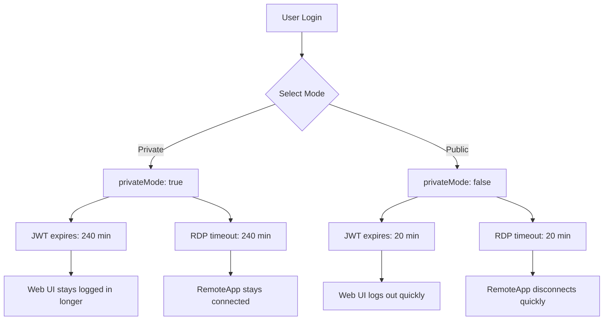

## Overview

RDSWeb Custom offers two session modes that control how long users remain authenticated and how long their RemoteApp sessions stay active. The mode is selected during login and affects both the web session (JWT token) and the RDP session timeout.

## Session Mode Types

### Private Mode

**Recommended for:** Personal devices, trusted computers, home office

- **Web session timeout:** 240 minutes (4 hours)
- **RDP session timeout:** 240 minutes (4 hours)
- **Use case:** Users working from their personal laptop or home workstation
- **Security assumption:** Device is physically secure and not shared

### Public Mode

**Recommended for:** Shared computers, public kiosks, hotel business centers

- **Web session timeout:** 20 minutes
- **RDP session timeout:** 20 minutes
- **Use case:** Users accessing from shared or untrusted devices
- **Security assumption:** Device may be accessed by others after user leaves

## How Session Modes Work



## Login Flow

Users select their session mode during login:

```javascript
// Frontend login request
const response = await fetch('/api/auth/login', {
  method: 'POST',
  headers: { 'Content-Type': 'application/json' },
  body: JSON.stringify({
    username: 'juan.perez',
    password: 'Usuario1234!',
    privateMode: true  // or false for public mode
  })
});
```

## Backend Implementation

### JWT Token Generation

The session mode is embedded in the JWT token:

```javascript
// backend/src/routes/auth.js
router.post('/login', async (req, res) => {
  const { username, password, privateMode } = req.body;
  
  // Authenticate against Active Directory
  const user = await authenticateUser(username, password);
  
  // Create JWT payload with session mode
  const payload = {
    username: user.username,
    displayName: user.displayName,
    email: user.email,
    domain: user.domain,
    groups: user.groups,
    privateMode: privateMode === true  // Store mode in token
  };
  
  // Sign token (max lifetime from config)
  const token = jwt.sign(payload, config.jwt.secret, { 
    expiresIn: config.jwt.expiresIn  // '8h' max
  });
  
  // Calculate cookie timeout based on mode
  const timeoutMinutes = privateMode ? 240 : 20;
  
  // Set cookie with mode-specific timeout
  res.cookie('rdweb_token', token, {
    httpOnly: true,
    secure: config.nodeEnv === 'production',
    sameSite: 'lax',
    maxAge: timeoutMinutes * 60 * 1000,  // Convert to milliseconds
    path: '/'
  });
  
  return res.json({ ok: true, user: { ... } });
});
```

### Timeout Calculation

```javascript
const timeoutMinutes = privateMode ? 240 : 20;

// Web session cookie
maxAge: timeoutMinutes * 60 * 1000  // Milliseconds

// RDP session timeout
`session timeout:i:${timeoutMinutes * 60}`  // Seconds
```

| Mode | Minutes | Cookie maxAge | RDP Timeout |
|------|---------|---------------|-------------|
| Private | 240 | 14,400,000 ms | 14,400 sec |
| Public | 20 | 1,200,000 ms | 1,200 sec |

## RDP File Generation

The session mode affects the generated RDP file:

```javascript
// backend/src/services/rdpService.js
function generateRemoteAppRdp(app, user, isPrivate = true) {
  const sessionTimeout = isPrivate ? 240 : 20;
  
  return [
    // ... other RDP settings ...
    
    // Session timeout in seconds
    `session timeout:i:${sessionTimeout * 60}`,
    'autoreconnection enabled:i:1'
  ].join('\r\n');
}
```

**Impact on user experience:**

- **Private mode (240 min):** User can work for 4 hours without interruption
- **Public mode (20 min):** Session disconnects after 20 minutes of total session time

## Session Mode Detection

The current session mode is available throughout the application:

### Backend (from JWT)

```javascript
router.get('/api/apps', authenticate, async (req, res) => {
  const { username, privateMode } = req.user;
  
  if (privateMode) {
    console.log(`User ${username} in private mode (4 hour session)`);
  } else {
    console.log(`User ${username} in public mode (20 min session)`);
  }
  
  // ...
});
```

### Frontend (from /auth/me)

```javascript
const response = await fetch('/api/auth/me');
const user = await response.json();

if (user.privateMode) {
  console.log('Private mode: Extended session');
} else {
  console.log('Public mode: Short session');
}
```

## User Experience Considerations

### Private Mode Experience

**Advantages:**
- Fewer interruptions during long work sessions
- Don't need to re-login frequently
- Better for tasks requiring sustained focus

**Disadvantages:**
- Higher security risk if device is stolen or accessed
- Token remains valid for 4 hours even if user walks away

**Best for:**
- Home office workers
- Employees with dedicated workstations
- Development and testing environments

### Public Mode Experience

**Advantages:**
- Reduced security risk on shared devices
- Forces users to re-authenticate frequently
- Minimizes exposure if user forgets to log out

**Disadvantages:**
- Frequent re-authentication required
- Disrupts long-running tasks
- May frustrate users for legitimate extended work

**Best for:**
- Shared kiosks in office lobbies
- Public computers (libraries, business centers)
- High-security environments
- Temporary or guest access

## Security Implications

### Token Lifetime vs. Cookie Lifetime

Two separate timeouts are at play:

1. **JWT Token Expiration** (`expiresIn: '8h'`)
   - Maximum token lifetime regardless of mode
   - Prevents tokens from being valid indefinitely
   - Set in `JWT_EXPIRES_IN` environment variable

2. **Cookie maxAge** (20 or 240 minutes)
   - Browser automatically deletes cookie after timeout
   - Forces re-login even if JWT hasn't expired
   - Shorter timeout provides better security

```javascript
// JWT expires in 8 hours
const token = jwt.sign(payload, secret, { expiresIn: '8h' });

// But cookie expires based on mode:
// - Public mode: 20 minutes
// - Private mode: 240 minutes
res.cookie('rdweb_token', token, {
  maxAge: timeoutMinutes * 60 * 1000
});
```

**Result:**
- Private mode: Cookie expires after 4 hours, user must re-login
- Public mode: Cookie expires after 20 minutes, user must re-login
- In both cases, even if cookie remained, JWT would expire after 8 hours

### RDP Session Timeout

The RDP session timeout is independent of the web session:

```rdp
session timeout:i:14400  # 240 minutes for private mode
```

**What happens on timeout:**
1. RDP client receives disconnect notification
2. Application saves state (if supported)
3. Session is disconnected (not logged off)
4. User can reconnect to resume session (if server allows)

### Idle vs. Session Timeout

**Session timeout** (what RDSWeb Custom sets):
- Total time since session start
- Disconnects after X minutes regardless of activity
- Cannot be extended without reconnecting

**Idle timeout** (server group policy):
- Time since last user input
- Can be configured separately in Windows Server
- Resets on any keyboard/mouse activity

**Recommendation:** Configure both for defense in depth:

```powershell
# Group Policy: Computer Configuration > Policies > Administrative Templates
# > Windows Components > Remote Desktop Services > Session Time Limits

# Set idle timeout (separate from RDSWeb Custom)
Set-GPRegistryValue -Name "RDS Session Limits" `
  -Key "HKLM\SOFTWARE\Policies\Microsoft\Windows NT\Terminal Services" `
  -ValueName "MaxIdleTime" `
  -Type DWord `
  -Value 1800000  # 30 minutes in milliseconds
```

## Mode Selection UI

Typical login form with mode selection:

```html
<form onsubmit="handleLogin(event)">
  <input type="text" name="username" placeholder="Username" required />
  <input type="password" name="password" placeholder="Password" required />
  
  <div class="session-mode">
    <label>
      <input type="radio" name="mode" value="private" checked />
      Private device (4 hour session)
    </label>
    <label>
      <input type="radio" name="mode" value="public" />
      Public device (20 minute session)
    </label>
  </div>
  
  <button type="submit">Sign In</button>
</form>

<script>
function handleLogin(event) {
  event.preventDefault();
  const formData = new FormData(event.target);
  const privateMode = formData.get('mode') === 'private';
  
  fetch('/api/auth/login', {
    method: 'POST',
    headers: { 'Content-Type': 'application/json' },
    body: JSON.stringify({
      username: formData.get('username'),
      password: formData.get('password'),
      privateMode: privateMode
    })
  });
}
</script>
```

## Configuration

Session timeouts are hardcoded but can be customized:

```javascript
// backend/src/routes/auth.js
const PRIVATE_TIMEOUT = 240;  // minutes
const PUBLIC_TIMEOUT = 20;    // minutes

const timeoutMinutes = privateMode ? PRIVATE_TIMEOUT : PUBLIC_TIMEOUT;
```

**To make configurable via environment variables:**

```javascript
// backend/src/config.js
module.exports = {
  session: {
    privateTimeout: parseInt(process.env.SESSION_PRIVATE_TIMEOUT) || 240,
    publicTimeout: parseInt(process.env.SESSION_PUBLIC_TIMEOUT) || 20
  }
};
```

```bash
# .env
SESSION_PRIVATE_TIMEOUT=240  # 4 hours
SESSION_PUBLIC_TIMEOUT=20    # 20 minutes
```

## Compliance Considerations

### PCI DSS

Payment Card Industry Data Security Standard requires:
- Maximum 15 minutes of inactivity timeout
- Re-authentication after idle period

**Solution:** Set public mode to 15 minutes or implement idle detection.

### HIPAA

Health Insurance Portability and Accountability Act recommends:
- Automatic logoff after period of inactivity
- Shorter timeouts for unattended workstations

**Solution:** Use public mode (20 min) or implement server-side idle timeout.

### SOC 2

Service Organization Control 2 requires:
- Session timeouts appropriate to risk level
- Re-authentication for sensitive operations

**Solution:** Use private mode only for trusted devices, public mode otherwise.

## Monitoring and Analytics

Track session mode usage:

```javascript
router.post('/login', async (req, res) => {
  const { privateMode } = req.body;
  
  // Log session mode selection
  console.log(`[AUTH] User ${username} logged in with mode: ${privateMode ? 'PRIVATE' : 'PUBLIC'}`);
  
  // Send to analytics
  analytics.track('user_login', {
    username: username,
    sessionMode: privateMode ? 'private' : 'public',
    timestamp: new Date().toISOString()
  });
  
  // ...
});
```

**Useful metrics:**
- Percentage of users choosing each mode
- Average session duration by mode
- Timeout-related disconnections
- Re-login frequency

## Troubleshooting

### Sessions Expiring Too Quickly

**Check:**
1. Cookie `maxAge` is set correctly: `timeoutMinutes * 60 * 1000`
2. JWT `expiresIn` is not shorter than intended timeout
3. Server clock is synchronized (JWT uses timestamps)
4. Browser is not clearing cookies prematurely

### Sessions Not Expiring

**Check:**
1. Cookie `maxAge` is being set (not `undefined`)
2. JWT expiration is enabled: `jwt.sign(payload, secret, { expiresIn: '8h' })`
3. Backend is validating token expiration: `jwt.verify(token, secret)`

### RDP Sessions Disconnect Prematurely

**Check:**
1. RDP file contains correct timeout: `session timeout:i:14400`
2. Server group policy doesn't override with shorter timeout
3. Network isn't dropping idle connections
4. RD Gateway timeout settings

## Best Practices

1. **Default to public mode** for security
2. **Educate users** on when to use each mode
3. **Monitor** mode selection patterns
4. **Align** RDP timeout with web session timeout
5. **Implement** server-side idle detection for compliance
6. **Test** both modes regularly
7. **Document** organizational policy on mode selection

## Next Steps

- Learn about [Authentication](/features/authentication) and JWT security
- Understand [RDP Generation](/features/rdp-generation) timeout configuration
- Explore the [RemoteApp Catalog](/features/remoteapp-catalog) system
